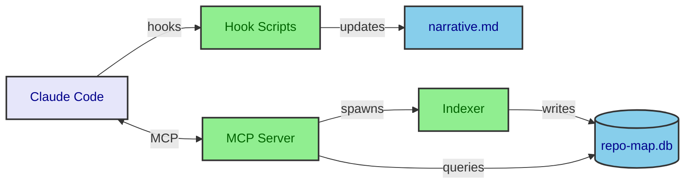
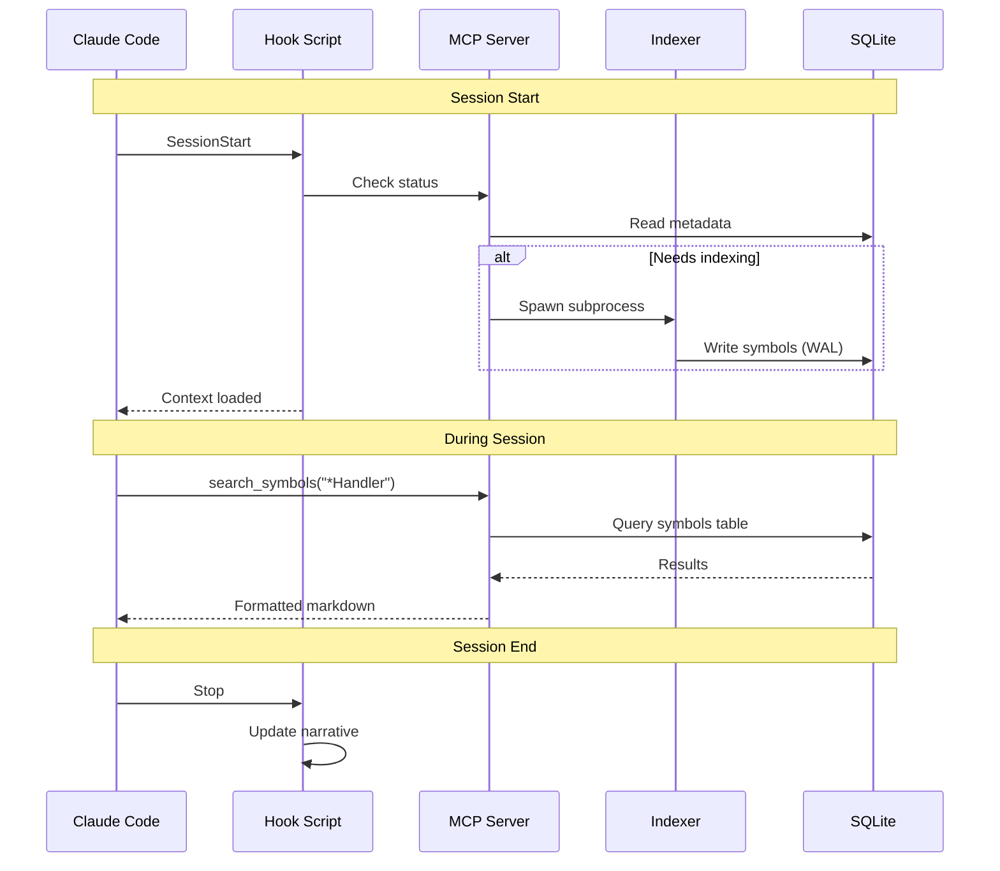
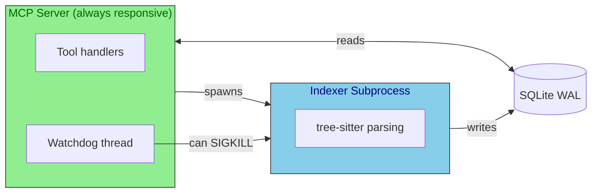

# Architecture

## Overview

context-daddy is a Claude Code plugin that helps AI assistants understand large codebases quickly and efficiently. It combines:

- **Tree-sitter parsing** - Extract semantic symbols (functions, classes, methods) from source code
- **SQLite caching** - Fast retrieval without re-parsing
- **MCP server** - Expose tools for code exploration
- **Narrative documentation** - Capture tribal knowledge that survives across sessions

The core philosophy: help Claude build understanding through structured symbol maps before diving into specific implementations.

## System Architecture



## Core Components

### MCP Server (`servers/repo-map-server.py`)

The MCP server provides tools for code exploration:

| Tool | Purpose |
|------|---------|
| `search_symbols` | Find functions/classes by name pattern (glob wildcards) |
| `get_symbol_content` | Get source code of a specific symbol |
| `get_file_symbols` | List all symbols in a file |
| `list_files` | List indexed files with optional glob filter |
| `reindex_repo_map` | Trigger re-indexing |
| `repo_map_status` | Check indexing status |
| `md_outline` | Get markdown document structure |
| `md_get_section` | Get content under a heading |

The server runs persistently during Claude sessions and handles concurrent requests while indexing runs in the background.

### Indexing Pipeline (`scripts/map.py`)

The indexer uses tree-sitter to parse source files and extract:
- Function/method signatures and docstrings
- Class definitions and inheritance
- Module-level constants and variables

**Supported languages**: Python, JavaScript/TypeScript, Rust, Go, C/C++, Java, Ruby, and more.

**Process isolation**: Indexing runs in a subprocess with resource limits:
- Memory: 4GB virtual address space
- CPU: 20 minutes timeout
- Watchdog monitors for hung processes

### Hook System

Hooks integrate with Claude Code's lifecycle:

| Hook | Trigger | Purpose |
|------|---------|---------|
| `SessionStart` | Session begins | Load context, trigger indexing |
| `Stop` | Session ends | Update narrative, capture learnings |

Hooks are autodiscovered from `hooks/hooks.json` - they don't need to be declared in `plugin.json`.

### Narrative Documentation

The narrative system captures "tribal knowledge" - the stories, decisions, and insights that accumulate around codebases:

- **`generate-narrative.py`** - Bootstrap narrative from git history and project structure
- **`update-narrative.py`** - Revise narrative after development sessions

Output lives in `.claude/narrative.md` and provides context that survives across sessions.

## Data Flow



## Process Architecture

### Why Multiprocess?

Tree-sitter is a native C extension that runs in-process. If parsing hangs (e.g., malformed file triggers infinite loop), the entire Python process freezes. Our solution:



**Benefits:**
- MCP server stays responsive during indexing
- Watchdog can kill hung indexer without affecting MCP
- SQLite WAL handles concurrent read/write safely

### Watchdog

The watchdog monitors indexing status:
- Checks every 60 seconds
- Detects indexing stuck >10 minutes
- Sets `status='failed'` and can SIGKILL the subprocess
- Safety check prevents hung process from overwriting database after intervention

## Database Schema

```sql
-- Symbol definitions
CREATE TABLE symbols (
    id INTEGER PRIMARY KEY,
    name TEXT NOT NULL,
    kind TEXT NOT NULL,           -- 'function', 'class', 'method'
    signature TEXT,
    docstring TEXT,
    file_path TEXT NOT NULL,
    line_number INTEGER NOT NULL,
    end_line_number INTEGER,
    parent TEXT                   -- For methods: parent class name
);

-- Full-text search (partially implemented)
CREATE VIRTUAL TABLE code_text_fts USING fts5(
    file_path UNINDEXED,
    line_number UNINDEXED,
    element_type UNINDEXED,
    symbol_name UNINDEXED,
    content
);

-- Indexing metadata
CREATE TABLE metadata (
    key TEXT PRIMARY KEY,
    value TEXT NOT NULL
);
-- Keys: status, db_version, last_indexed, symbol_count
```

## Design Decisions

### Subprocess over threads

**Problem**: Hung tree-sitter parsing would freeze the entire MCP server.

**Solution**: Run indexing in a subprocess that can be killed independently.

### WAL mode + single transaction

**Problem**: Crash during indexing could leave database in partial state.

**Solution**: All writes in a single transaction; crash = rollback to clean state.

### Markdown over JSON

**Problem**: JSON responses consume context tokens inefficiently.

**Solution**: MCP tools return formatted markdown that's human-readable and compact.

### Hooks autodiscovery

**Problem**: Declaring hooks in both `plugin.json` and `hooks/hooks.json` caused validation errors.

**Solution**: Hooks are autodiscovered from `hooks/hooks.json` only. Don't declare them in `plugin.json`.

### Narrative documentation

**Problem**: Traditional docs capture what code does, not why or what was learned building it.

**Solution**: Generate and evolve "tribal knowledge" narratives that capture project stories, gotchas, and evolving understanding.
