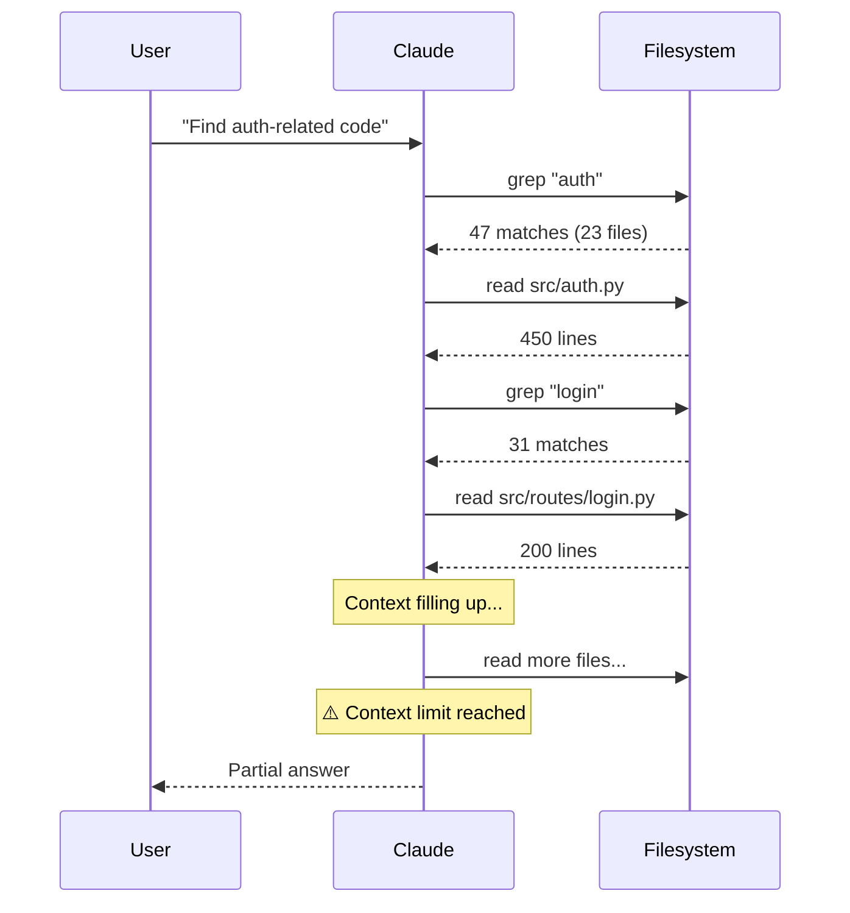
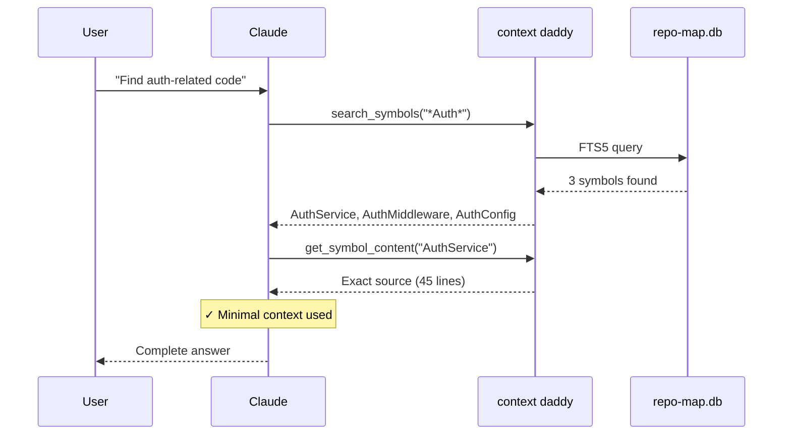

# Why Claude Code forgets your codebase (and how to fix it)

If you've used Claude Code on a large project, you know the frustration. Ask it about your authentication module and it reads files randomly, eventually piecing together an answer—or giving up. Hit context limits and watch it forget everything you just discussed. Explain the same architectural decision for the third time this session.

Claude Code is powerful, but it explores codebases like a tourist with a bad map.

**context daddy** gives it a better map.

## The Problem: Context Is Precious

Claude Code's context window is finite. Every file read, every grep result, every explanation consumes tokens. Large codebases exhaust that budget fast.

The default exploration pattern—grep, read file, grep again, read another file—is inefficient. Claude burns context *finding* code before it can start *understanding* it.

And when context compaction kicks in? All that exploration work vanishes. Claude forgets what it learned and starts over.

## A Better Way: Semantic Maps

What if Claude could query your codebase like a database?

Here's what exploring code looks like without context daddy:



And with context daddy:



The difference is stark. Instead of flooding context with raw file contents:

```
search_symbols("*Handler")         → All handler classes, instantly
get_symbol_content("AuthService")  → Full source code
get_file_symbols("src/api.py")     → Everything defined in that file
```

That's what context daddy provides. A pre-indexed symbol database powered by tree-sitter and SQLite FTS5. Instant lookups instead of recursive grep, with targeted results that don't flood the context window.

The MCP server runs in the background, responding to Claude's queries. Instead of reading your entire `src/` directory, Claude asks for exactly what it needs.

## Beyond Code: Capturing Tribal Knowledge

Understanding code isn't just about syntax. Every codebase has stories that live in people's heads—not in comments or docs.

context daddy captures that knowledge in `.claude/learnings.md`:

```markdown
### SQLite FTS5 tokenizer gotcha (2025-01-15)
**Insight**: FTS5 unicode61 tokenizer splits on underscores
**Context**: Symbol search was missing `get_user_by_id`
when searching for "user"
**Fix**: Use trigram tokenizer for symbol names
```

When Claude's context compacts, these learnings survive. You explain something once; Claude remembers it across sessions.

## Getting Started

```bash
# Install the plugin
claude plugin marketplace add chipflow/context-daddy
claude plugin install context-daddy

# Verify MCP tools are connected
claude mcp list  # Should show: repo-map: ✓ Connected

# Generate a narrative for your project
cd /path/to/your-project
/context-daddy:story
```

First indexing takes a moment. After that, Claude has instant access to your codebase's structure.

## What Gets Generated

```
.claude/
├── narrative.md           # Your project's story
├── project-manifest.json  # Build system, languages detected
├── repo-map.db            # Symbol index (SQLite)
├── learnings.md           # Persistent insights
└── logs/                  # Debug info
```

The narrative bootstraps from your git history—commits become a story of how the project evolved. You can refine it with `/context-daddy:refresh` after working sessions.

## The Commands

| Command | What It Does |
|---------|--------------|
| `/context-daddy:story` | Bootstrap narrative from git history |
| `/context-daddy:refresh` | Update narrative after a session |
| `/context-daddy:status` | Check indexing progress |
| `/context-daddy:help` | Guide to MCP tools |

## How It Actually Works

Three components:

1. **Tree-sitter indexing** — Parses Python, Rust, C++, TypeScript into semantic symbols
2. **SQLite + FTS5** — Fast retrieval and full-text search
3. **MCP server** — Tools Claude can query directly

Indexing runs in isolated subprocesses with memory limits and watchdog monitoring. Heavy parsing can't freeze your session.

Hooks integrate with Claude Code's lifecycle—context loads at session start, guidance appears after compaction.

## The Journey

We started simple: parse code with tree-sitter, generate maps. Then reality hit.

Memory exploded on large codebases. We moved to incremental caching. Static maps weren't enough—we built a live MCP server. Process management became a nightmare; we iterated through three architectures before landing on isolated subprocesses.

Along the way, a philosophical shift: we realized the *stories* around code matter as much as the code itself. That's where narratives and learnings came from.

We're still figuring things out. Cache invalidation feels heavyweight. Narrative maintenance needs better patterns. The FTS5 search capabilities are underutilized.

But it works. Claude explores our codebases faster and remembers what matters.

## Try It

```bash
claude plugin marketplace add chipflow/context-daddy
```

Your codebase's context needs a responsible adult.
